</br>

<h1>
<a href="#">
  <p align="center">
    
  </p>
  <p align="center"\>
  Adocão
  </p>
</a>
</h1>

</br>

> This web is a vanilla Front-end (JS/HTML/CSS) and (Node.js/Express) to the Back-end 🐶💻

<br>
<hr>
<br>

<h4 align="center"\>
<a href="https://github.com/RickelmeDias/AdoCao" target="_blank"></a>
<a href="https://github.com/RickelmeDias/AdoCao" target="_blank"></a>
<a href="https://github.com/RickelmeDias/AdoCao" target="_blank"></a>
</br></br>
<a href="#">


</a>
</br>

<br>
<hr>
<br>

### Index

🟠 [Project Description](#project-description)

🟠 [Functionalities](#functionalities)

🟠 [Deploy](#deploy)

🟠 [Technologies used](#technologies-used)

🟠 [How to run this project](#how-to-run-this-project)
 
</br>

<br>
<hr>
<br>

## Project Description

<p align="justify">
</br>📃 The purpose of this project is to learn more about vanilla Javscript, HTML, CSS, form, json, form-data, api creation, login, register and also turn available this code for other people improve their studies and this source-code.
</p>
<p>
🐕‍🦺 My inspiration to start this project was the dogs, because I love dogs and wanted to make something that will help them.
This site makes possible for dogs to have adoptive owners.
</p>
<br>
<hr>
<br>

## Functionalities

<p align="justify">
</br>✔️ Form to Sign-in;
</br>✔️ Form to Register;
</br>✔️ Form to Create breed;
</br>✔️ Form to Post a new dog;
</br>✔️ Import images to create a new dog on form;
</br>✔️ Crop image on form before send to the backend;
</br>✔️ Decrease image resolution and weight;
</br>✔️ Get all dogs;
</br>✔️ Search dog letter by letter;
</br>✔️ Responsive;
</br>✔️ Register account on database;
</br>✔️ JWT Token authentication;
</br>✔️ Verify authentication on all pages;
</br>✔️ Permissions to post a new dog (just logged);
</br>✔️ Bcrypt password on database;
</br>✔️ And more.
</p>

<br>
<hr>
<br>

## Deploy

<h3>🎯 Front-end</h3>

✔️ AdoCao home page.
<details>
  <p align="center">
    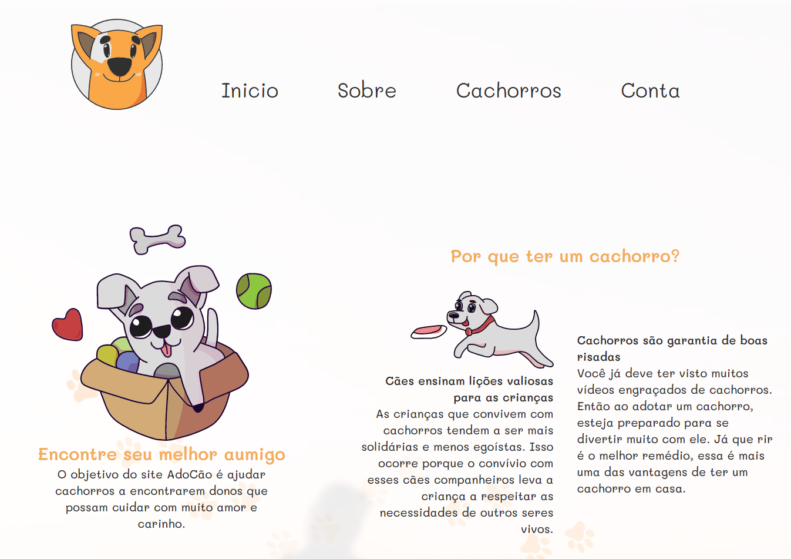
  </p>
</details>
</br>
✔️ AdoCao all dogs cards.
<details>
  <p align="center">
    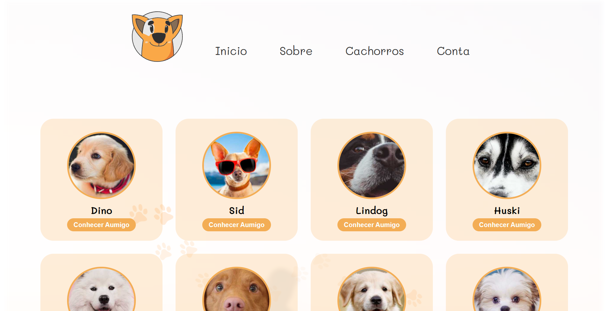
  </p>
</details>
</br>
✔️ AdoCao posting/creating a new Dog.
<details>
  <p align="center">
    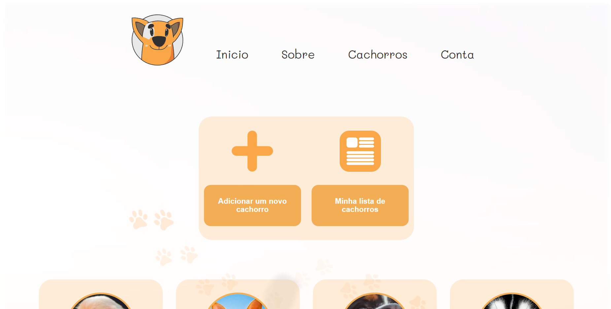
    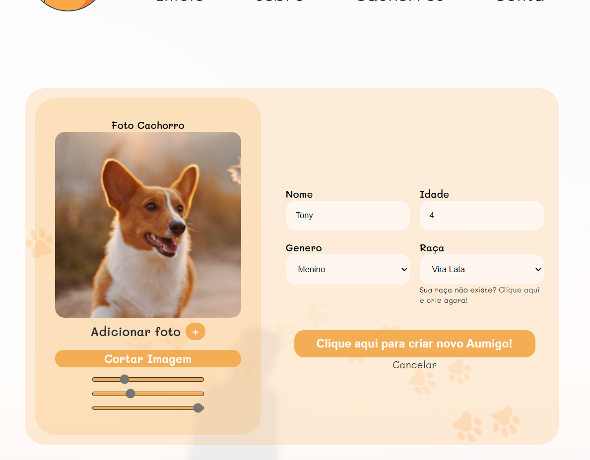
    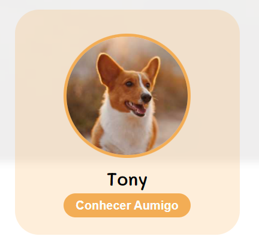
    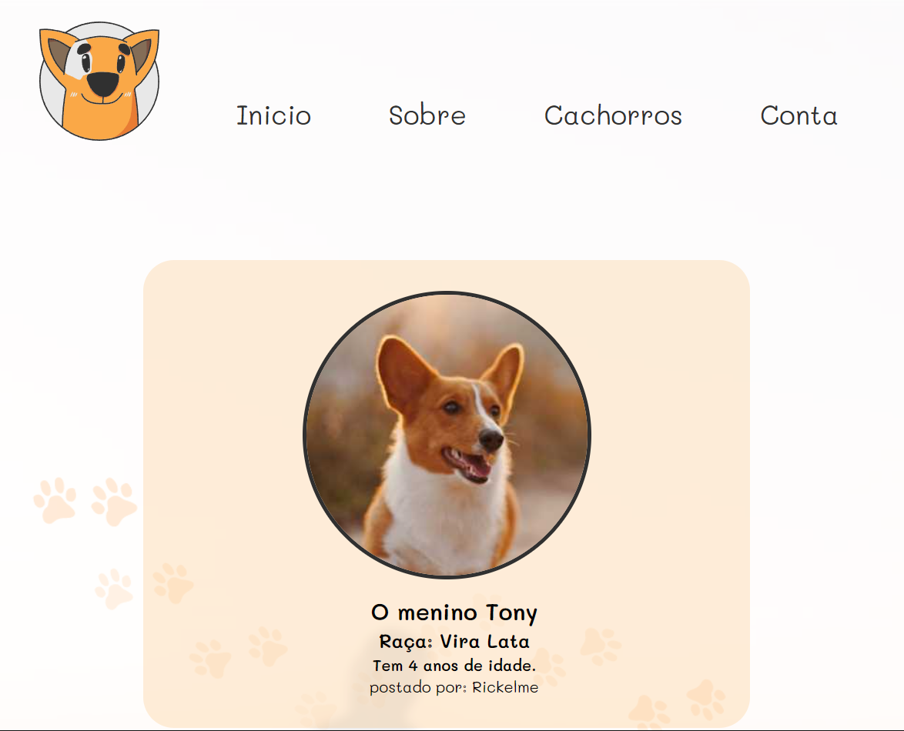
  </p>
</details>
</br>
✔️ Logged account
<details>
<p align="center">
    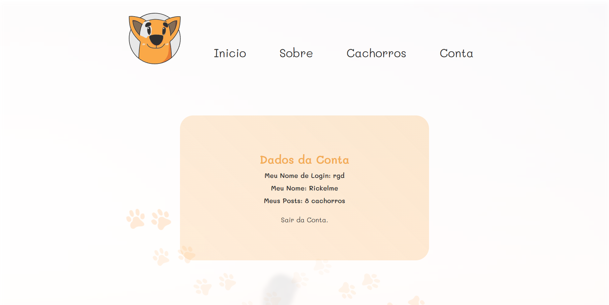
</p>
</details>
</br>


<br>
<hr>
<br>


## Technologies used
<br>
<h3>Web Designs</h3>


<br><br>
<h3>Front-end</h3>
<p align="justify">


<br><br>
<h3>Back-end</h3>
<p align="justify">


</p>


<br>
<hr>
<br>


## How to run this project
<h2>🎯 Front-end</h2>

It's easy, just run the live server clicking on main index.html.

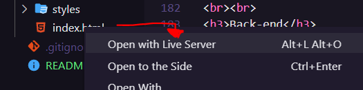

```
$ To run the front-end you just need to get the live-server extension on your vscode and run as we did in the previous image..
```
<br>
<hr>
<br>
<h2>📮 Back-end</h2>
<h4>🔷 Dependencies</h4>
<h4>🔷 On the back-end folder have a file named "package.json"</h4>
<h5>⬛️ You NEED to install the dependencies from package.json file</h5>

```console
 npm install
```

<h4>🔷 Environment Settings</h4>
<h4>🔷 Now you need to set the environment.</h4>
<h5>⬛️ Follow the pattern below</h5>

```js
MYSQL_USER=String
MYSQL_PASS=String
MYSQL_DATB=String
MYSQL_HOST=String
MYSQL_PORT=Number

JWT_TOKEN=String
JWT_SALT=Number
```

<h5>⬛️ Example: </h5>

```js
MYSQL_USER="yourDatabaseUser"
MYSQL_PASS="yourDatabaseUserPassword"
MYSQL_DATB="yourDatabaseName"
MYSQL_HOST="yourDatabaseHost"
MYSQL_PORT=3312

JWT_TOKEN="YourCustomToken"
JWT_SALT=5
```

<h4>🔷 Running Back-end server</h4>
<h4>🔷 Run start/test (node run/nodemon).</h4>
<h5>⬛️ To run code without intending to modify it: </h5>

```console
 npm start
```

<h5>⬛️ To test and do modifies, use nodemon execution: </h5>

```console
 npm test
```
<br>
<hr>
<br>

<h2>🗄️ Database</h2>

To run the backend without mistakes you need to configure your database. To configure it same as my project you could use this database settings:

<br>

> adocao_db aumigos table
<details align="center">
<p align="center">
    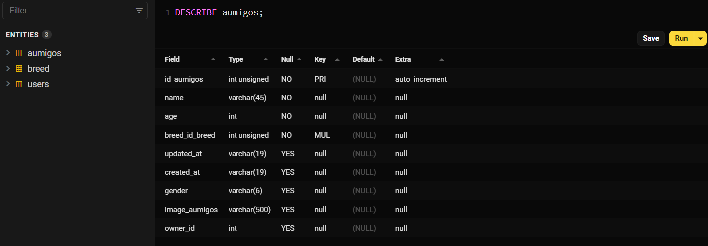
</p>
</details>
<br>

> adocao_db breed table
<details align="center">
<p align="center">
    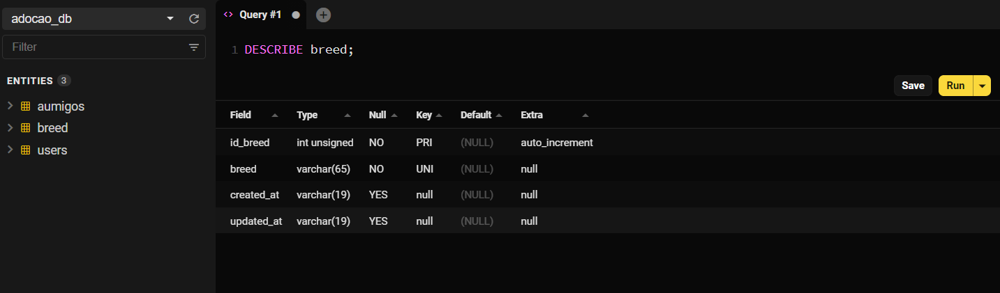
</p>
</details>
<br>

> adocao_db users table
<details align="center">
<p align="center">
    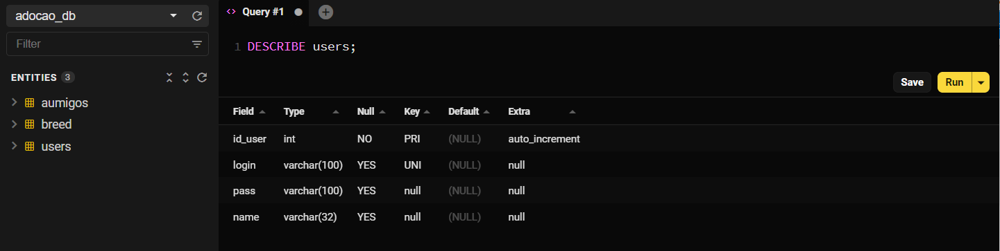
</p>
</details>
<br>
<hr>
<br>
## Developer

[<br><sub>Rickelme Dias</sub>](https://github.com/RickelmeDias) 
